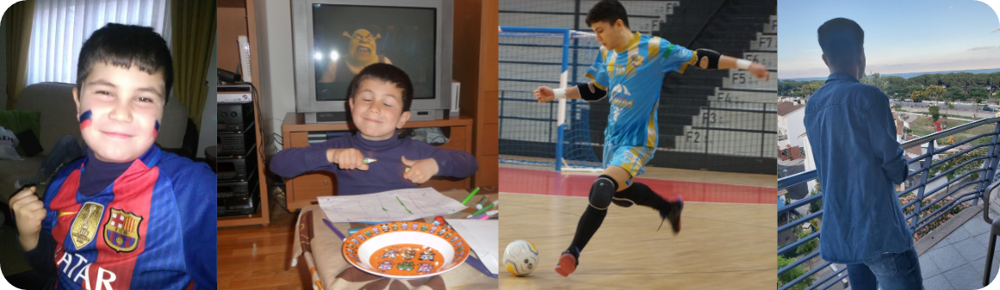

# Hola, soy Mario!👽
### Estudiante de DAM en Institut Poblenou                                                                                                                                       

                                                                                                                                      

Un joven entusiasta de la tecnología, actualmente enfocado en el inmenso mundo de la programación.  Futuro Desarrollador de Backend🌠                                             
*Gustos y Hobbies:*                                                                                                                                                              
- Futbol sala⚽
- Videojuegos🎮
- Estoicismo 
- Geopolítica🌍
- Música🎵
- Java🤓
- Odiar el Lol👍                                                                                                                                                                   

## Lo que se:                                                                                                                                                                      

                                                                       

## Lo que tengo por aprender: 

                                                    

# Redes:🔗

                   
      

                                                                                                                                                                                       
 

  
  
  
                                                                                                                                                                              
